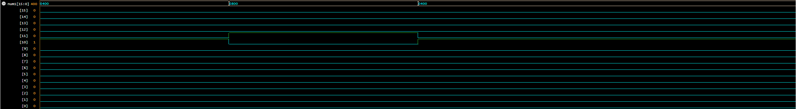
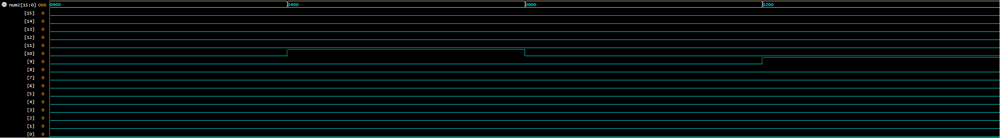
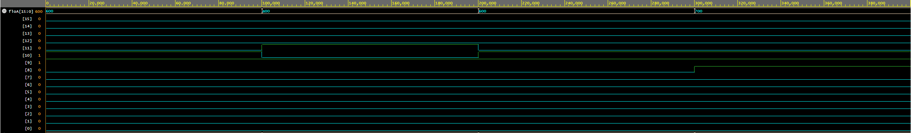
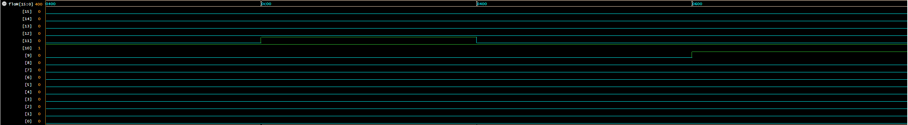

# FP16 Arithmetic Unit — FPGA Implementation

A 16-bit floating-point adder and multiplier implemented in Verilog on an FPGA. Built as a semester project for the Digital System Design course (2021).

## Features

- Half-precision (16-bit) floating-point addition and multiplication
- FSM-based control flow: select operation, enter two operands via switches, view result
- 4-digit seven-segment display output
- Hardware button debouncing
- XSim simulation testbench included

## Floating-Point Format

| Field | Bits | Width |
|---|---|---|
| Sign | [15] | 1 bit |
| Exponent | [14:10] | 5 bits |
| Mantissa | [9:0] | 10 bits (implicit leading 1) |

Total: 16 bits per operand and result.

## Module Overview

| File | Module(s) | Description |
|---|---|---|
| `addmut.v` | `float_multi`, `floatadder` | Floating-point multiplier and adder |
| `top.v` | `FloatAddMult` | Top-level FSM controller and I/O wiring |
| `debouncer.v` | `debouncer` | 3-stage shift-register button debouncer |
| `seven.v` | `ssdDecode`, `ssd_cntr` | 7-segment display decoder and time-multiplexed driver |
| `tb.v` | `operatorCore_sim` | Simulation testbench |

## State Machine

```
         btnU (add)
         btnL (multiply)
         
  [IDLE] ──────────────► [WAIT1]  set switches → num1
                              │
                         any button
                              │
                              ▼
                          [WAIT2]  set switches → num2
                              │
                         any button
                              │
                              ▼
                          [RESULT] result shown on 7-segment display
```

## Hardware Interface

| Signal | Direction | Description |
|---|---|---|
| `sw[15:0]` | Input | 16-bit operand input via switches |
| `btnU` | Input | Select floating-point addition |
| `btnL` | Input | Select floating-point multiplication |
| `btnR`, `btnD` | Input | Advance FSM (any button) |
| `clk` | Input | System clock |
| `rst` | Input | Synchronous reset (returns to IDLE) |

## Simulation Results

Behavioural simulation run in EDA Playground (Icarus Verilog). Four test cases verified:

| Test | num1 | num2 | Expected | Result |
|---|---|---|---|---|
| ADD 2.0 + 1.0 | `0x0400` | `0x0000` | 3.0 (`0x0600`) | ✓ |
| ADD 4.0 + 2.0 | `0x0800` | `0x0400` | 6.0 (`0x0A00`) | ✓ |
| MUL 2.0 × 1.0 | `0x0400` | `0x0000` | 2.0 (`0x0400`) | ✓ |
| MUL 2.0 × 1.5 | `0x0400` | `0x0200` | 3.0 (`0x0600`) | ✓ |

**Inputs**

| num1 | num2 |
|---|---|
|  |  |

**Outputs**

| Adder (floA) | Multiplier (floM) |
|---|---|
|  |  |

## Getting Started

1. Open `addmult/addmult.xpr` in Xilinx Vivado 2019.1 or later
2. Run behavioral simulation using `tb.v` to verify the adder and multiplier
3. Synthesize and implement for your target board
4. Connect switches, buttons, and 7-segment display per your board's XDC constraints

No external IP cores or licences required.

## Tech Stack

| Layer | Technology |
|---|---|
| Language | Verilog HDL |
| Toolchain | Xilinx Vivado 2019.1 |
| Simulation | XSim |
| Target | Xilinx FPGA (Nexys/Artix-7 class) |
| Min input width | 16 switches |
